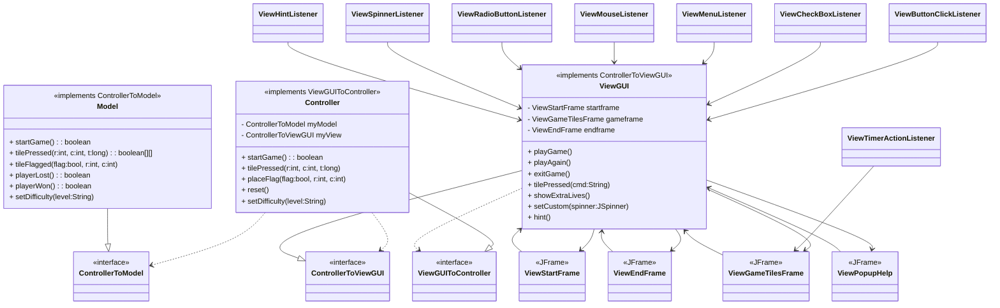

```mermaid
classDiagram
    %% ─────────── Interfaces ───────────
    class ControllerToModel      <<interface>>
    class ControllerToViewGUI    <<interface>>
    class ViewGUIToController    <<interface>>

    %% ─────────── Core classes ─────────
    class Controller {
        - ControllerToModel   myModel
        - ControllerToViewGUI myView
        + startGame() : boolean
        + tilePressed(r:int, c:int, t:long)
        + placeFlag(flag:bool, r:int, c:int)
        + reset()
        + setDifficulty(level:String)
        <<implements ViewGUIToController>>
    }

    class Model {
        + startGame() : boolean
        + tilePressed(r:int, c:int, t:long) : boolean[][]
        + tileFlagged(flag:bool, r:int, c:int)
        + playerLost() : boolean
        + playerWon()  : boolean
        + setDifficulty(level:String)
        <<implements ControllerToModel>>
    }

    class ViewGUI {
        - ViewStartFrame      startframe
        - ViewGameTilesFrame  gameframe
        - ViewEndFrame        endframe
        + playGame()
        + playAgain()
        + exitGame()
        + tilePressed(cmd:String)
        + showExtraLives()
        + setCustom(spinner:JSpinner)
        + hint()
        <<implements ControllerToViewGUI>>
    }

    %% ───────── Swing frames (views) ─────────
    class ViewStartFrame      <<JFrame>>
    class ViewGameTilesFrame  <<JFrame>>
    class ViewEndFrame        <<JFrame>>
    class ViewPopupHelp       <<JFrame>>

    %% ───────── Listener classes ─────────
    class ViewButtonClickListener
    class ViewCheckBoxListener
    class ViewMenuListener
    class ViewMouseListener
    class ViewRadioButtonListener
    class ViewSpinnerListener
    class ViewTimerActionListener
    class ViewHintListener

    %% ─────────── Relationships ──────────
    Controller  ..>  ControllerToModel
    Controller  ..>  ControllerToViewGUI
    Controller  --|> ViewGUIToController

    Model       --|> ControllerToModel
    ViewGUI     --|> ControllerToViewGUI
    ViewGUI     ..>  ViewGUIToController

    ViewGUI     -->  ViewStartFrame
    ViewGUI     -->  ViewGameTilesFrame
    ViewGUI     -->  ViewEndFrame
    ViewGUI     -->  ViewPopupHelp

    ViewStartFrame      -->  ViewGUI
    ViewGameTilesFrame  -->  ViewGUI
    ViewEndFrame        -->  ViewGUI
    ViewPopupHelp       -->  ViewGUI

    ViewButtonClickListener    -->  ViewGUI
    ViewCheckBoxListener       -->  ViewGUI
    ViewMenuListener           -->  ViewGUI
    ViewMouseListener          -->  ViewGUI
    ViewRadioButtonListener    -->  ViewGUI
    ViewSpinnerListener        -->  ViewGUI
    ViewHintListener           -->  ViewGUI
    ViewTimerActionListener    -->  ViewGameTilesFrame
```
